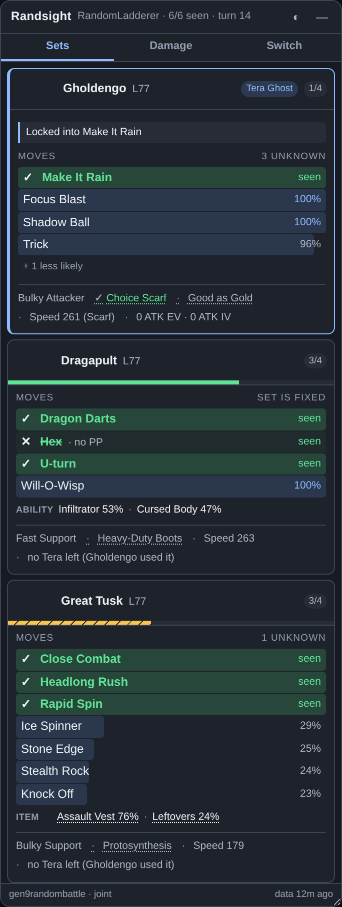
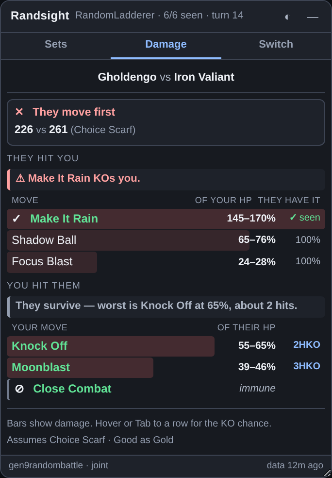
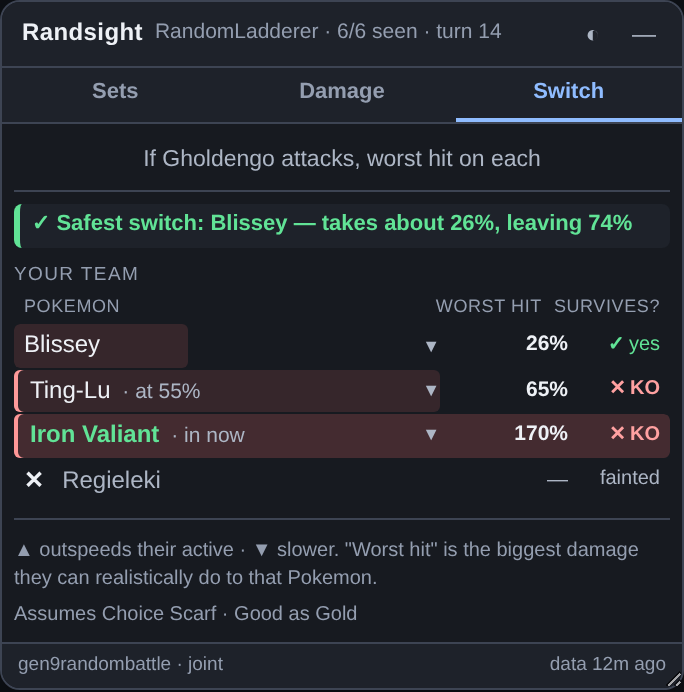
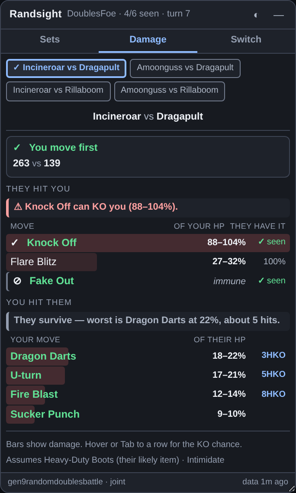

# Randbats Live

A Chrome extension that watches your Pokémon Showdown Random Battle and tells you, live,
what the opposing Pokémon is probably running — not just "here are all the possible sets",
but an actual posterior that tightens every time they reveal a move, an item, or a Tera type.

No more typing `/randbats <mon>` mid-turn and reading a wall of text.



| Damage | Switch | Doubles |
|---|---|---|
|  |  |  |

---

## What it does

For every Pokémon on the opposing team it shows:

- **Role posterior** — Gen 8/9 Random Battles pick a *role* (Bulky Setup, Fast Support,
  Wallbreaker…) and then draw moves from that role's pool. The panel shows `P(role | what
  you've seen)`, which usually collapses to a single role after two or three reveals.
- **Per-move probability** — every move they could still be holding, with the chance
  it's in their last unknown slots. Revealed moves are marked `seen`.
- **Item, ability and Tera type distributions**, conditioned on the same evidence.
- **Speed at their actual level**, plus the Choice Scarf number and how likely Scarf is.
- Level, EV/IV overrides, HP, status, and how many slots are still unknown.
- **Hover any row for a description** — what that item, ability or move actually does, pulled
  live from the client's own dex. Moves also show type, category, base power, accuracy and
  priority, so you can size up a predicted move without leaving the panel.

### A card shows what's still in doubt, not everything it knows

The first version printed every distribution as a full block of bars, down to options at a
fraction of a percent. That is more screen than a mid-turn glance can absorb, so a card now
spends its space in proportion to how uncertain each thing is:

| State | How it renders |
|---|---|
| Revealed, or ≥ 95% certain | one muted word on the facts line — `Fast Support · Heavy-Duty Boots · Speed 263` |
| Genuinely in doubt | a compact one-liner — `ITEM  Assault Vest 80% · Leftovers 20%` |
| Moves, ≥ 15% or revealed | full rows with bars — this is the part you're actually reading |
| Moves below 15% | behind one `+ 3 less likely` click |
| Only one possible value | not shown at all |

Nothing is lost: collapsed facts keep their hover descriptions, and the long tail is one
click away. In the test fixture this took the busiest card from 13 rows to 7 without
removing a single feature. A revealed Tera type is a header chip, so it isn't repeated as a
fact, and a Pokemon whose set is fully determined says `set is fixed` rather than
`4 unknown`.

### Evidence the battle gives away, that set data cannot

The published stats describe a Pokemon in the abstract. The battle in front of you is telling
you more than that, constantly, and most of it was going in the bin:

- **Terastallization is once per side.** The moment they Tera, every *other* Pokemon on their
  team has a Tera type it will never use. The panel drops the whole distribution and says
  `no Tera left (Gholdengo used it)`. On a six-card panel that removes five blocks of numbers
  that could no longer matter.
- **Choice lock.** If they have committed to a move and could be holding a Choice item, they
  cannot pick anything else until they switch. Stated as the conditional it actually is —
  *"Locked into Make It Rain if Choice (78%)"* — or flatly, when the item is already revealed.
  The bridge takes its own baseline when a Pokemon comes in, so opening the panel mid-turn
  never invents a lock that isn't there.
- **PP.** A move used to its limit cannot happen again, whatever the posterior says. It is
  struck through, labelled `no PP`, and dropped from the threat ranking in the Switch tab.

None of this needs a model. It was always on screen; nothing was reading it.

A second **Damage** tab turns the prediction into numbers for the current matchup:

- **Incoming** — every move their active Pokémon might have, with its damage range against
  yours *and how likely they actually have it*, ranked by threat (damage discounted by
  probability). This is the part that needs the prediction engine; a plain calculator can't
  rank a move it doesn't know they have.
- **Outgoing** — your own moves against them, using their most likely item and ability.
- **Immunities are shown, not hidden** — a move that can't touch the target is the thing you
  most need told.
- Weather, terrain, screens and stat boosts are all folded in, and the panel states which
  predicted item and ability it assumed.
- Damage is marginalised over the **item and ability posteriors together**, not a single most
  likely set — a 55/45 Thick Fat split turns a confident "24–29%, 4HKO" into "24–58%", and the
  `±` marks it.

**In doubles there are up to four pairings, and you pick.** Earlier versions analysed slot 0
on each side without saying so, which is a quiet way to be wrong half the time. Every pairing
that is actually on the field is offered as a button; the Switch tab meanwhile ranks your
bench against the **whole** opposing field, because being safe from one of their two actives
is not being safe.

A third **Switch** tab answers the other question you ask every turn:

- Each of your six ranked by the **worst realistic hit** their active can land on it —
  damage discounted by how likely they actually have that move.
- A **survives?** column that just says `yes` or `KO`.
- ▲/▼ for whether that slot outspeeds their active once it's in.
- It leads with the answer: *"Safest switch: Blissey — takes about 32%, leaving 68%"*.

"Safest" means **HP left standing**, not the smallest damage figure. A wall already chipped
to 55% that takes 25% is in more danger than a healthy one that takes 32%, so chipped slots
show their current HP inline and sort accordingly. If nothing on the bench lives through
their best hit, the tab says exactly that instead of recommending a Pokemon that dies.

### Every number is labelled, and each section leads with the answer

Both tabs are built so you never have to work out what a column means:

```
THEY HIT YOU
│ You survive — worst is Headlong Rush at 64%, about 2 hits.
  MOVE                        OF YOUR HP    THEY HAVE IT
  Headlong Rush                  54–64%             seen
  Ice Spinner                    24–29%              24%

YOU HIT THEM
│ Moonblast can KO them (65–115%).
  YOUR MOVE                  OF THEIR HP
  Moonblast                     65–115%      OHKO  ±
```

The verdict line at the top of each section is the thing you actually read; the rows are
there when you want the detail. Damage is computed across the **whole item distribution**
rather than the single most likely item, and `±` marks the moves where that choice changes
the answer — Great Tusk's Assault Vest versus Leftovers swings one move by 38 points.

The **Damage** tab opens with a speed verdict — who moves first, folding in boosts,
paralysis, Tailwind, Trick Room, and the Choice Scarf you can only assign a probability to
("You move first — unless Choice Scarf", with the number it would become and how likely).

It reads the battle live, so all of this updates in place as the match goes on.

### Why the numbers move the way they do

Reveal one move and the whole picture can snap into focus. Some examples from the test suite:

| Situation | Result |
|---|---|
| Arbok uses **Trailblaze** | Bulky Setup → 100%. Coil, Earthquake and Gunk Shot become certain; Toxic Spikes and Glare drop to zero. |
| Arbok uses **Glare** | Fast Support → 100%. Knock Off jumps 23% → 60%, because there's now one fewer slot to share among the remaining options. |
| Dragapult uses **Dragon Darts** + **U-turn** | Fast Attacker is eliminated (it has no Dragon Darts). Fast Support → 100%, so Hex and Will-O-Wisp are *guaranteed* — you know both remaining moves before they're used. |
| Gholdengo is holding **Choice Scarf** | Bulky Attacker → 100% (Bulky Support only ever runs Leftovers). Focus Blast becomes certain; Recover is ruled out. |

That last one is the point of the whole thing: the *item* told you the moveset.

---

## Install

> **Publishing:** see [PUBLISH.md](PUBLISH.md) — the repo is ready to push, CI is
> wired up, and the store listing copy is written out in [docs/LISTING.md](docs/LISTING.md).


The extension isn't on the Web Store, so load it unpacked:

1. Unzip this folder somewhere permanent — Chrome reads it from disk every launch.
2. Open `chrome://extensions`.
3. Turn on **Developer mode** (top right).
4. Click **Load unpacked** and pick the `randbats-live` folder (the one with `manifest.json`).
5. Open <https://play.pokemonshowdown.com> and start a Random Battle.

Needs Chrome 111+ (for `world: "MAIN"` content scripts). Works in Edge, Brave and other
Chromium browsers the same way.

A guide to reading the panel — the three tabs, the KO vocabulary, and the signals that are easy
to miss — opens automatically the first time you install it, and is always available from the
toolbar popup. It ships inside the extension at `guide/guide.html`: no webfonts, no CDN,
nothing that phones home.

The panel drags by its title bar and resizes from the bottom-right corner; position, size,
theme and which cards are expanded all persist. The toolbar popup toggles the overlay,
switches between tracking the opponent and your own side, and force-refreshes the set data.

---

## How the prediction works

### The data

[`pkmn/randbats`](https://github.com/pkmn/randbats) regenerates every Random Battle format
hourly by simulating 100,000 teams and recording what came out. For each species it
publishes, per role: the role's weight, and each move's **marginal inclusion probability** —
the fraction of that role's sets containing it. Those marginals sum to exactly 4.

```json
"Arbok": {
  "roles": {
    "Fast Support": {
      "weight": 0.3318,
      "items": { "Life Orb": 0.716, "Leftovers": 0.1197, "Focus Sash": 0.0913, "Choice Band": 0.073 },
      "moves": { "Gunk Shot": 1, "Earthquake": 0.7931, "Knock Off": 0.6998,
                 "Glare": 0.574, "Toxic Spikes": 0.4949, "Sucker Punch": 0.4381 }
    }
  }
}
```

Marginals alone aren't enough to answer "given they've shown Glare, how likely is Knock Off?"
— that needs a joint distribution over 4-move sets. So we reconstruct one.

**But marginals have a harder limit**, and it took measuring to find it. See
[The joint model](#the-joint-model) below.

### The model

A set is modelled as a **conditional Bernoulli** sample: draw a role `r` with probability
`w_r`, then draw exactly `k = 4` moves from that role's pool with

```
P(S) ∝ ∏_{m ∈ S} θ_m ,   |S| = k
```

The `θ` are unknown, but they're pinned down by requiring that the resulting marginal
inclusion probabilities match the published ones. We solve for them by iterative
proportional fitting: compute each move's marginal under the current `θ`, scale `θ_m` by
`π_m / marginal_m`, repeat. It converges to ~1e-11 in well under 200 iterations.

Moves with `π = 1` are pulled out first as guaranteed slots — they'd send `θ` to infinity,
and removing them shrinks the pool for free.

### The queries

With `θ` in hand, everything is a ratio of **elementary symmetric polynomials**, computed by
DP over the pool — no sampling, no approximation:

```
P(O ⊆ S)          = (∏_{i∈O} θ_i) · e_{k-|O|}(θ \ O) / e_k(θ)
P(m ∈ S | O ⊆ S)  = θ_m · e_{k-|O|-1}(θ \ (O ∪ {m})) / e_{k-|O|}(θ \ O)
```

Pools are at most ~14 moves with `k ≤ 4`, so this costs microseconds.

The role posterior is then plain Bayes, with the item, ability and Tera observations
multiplying into the likelihood alongside the moves:

```
P(r | O) ∝ w_r · P(O_moves | r) · P(item | r) · P(ability | r) · P(tera | r)
```

and the displayed move probability is the mixture `Σ_r P(r | O) · P(m ∈ S | O, r)`.

### When the evidence doesn't fit

A revealed detail sometimes matches no known set — stale data, an unusual forme, a
misattributed called move. Rather than zeroing out every hypothesis, the engine drops the
**fewest** observations that restore a consistent posterior and names what it ignored. So an
impossible Tera type doesn't cost you the role information the item already gave you. Moves
that appear in no role at all are flagged and excluded rather than treated as contradictions.

## How it compares to the other extensions

The two maintained randbats extensions — [Randbats Tooltip](https://github.com/pkmn/randbats)
and [Showdex](https://github.com/doshidak/showdex) — use the same modelling approach, arrived
at independently. Both **filter roles by a boolean check** (drop a role if a revealed move or
Tera type isn't in its pool) and then print each surviving role's *published marginal
percentages*, unchanged. Showdex goes further and, in Random Battles specifically, deliberately
skips the item and ability gates as "a sampled, NON-discriminative drop".

`test/rivals.test.js` reimplements that algorithm from their published source and scores it
against ours on the same held-out sets, over the same candidate support, so no model is
excused for simply omitting an option it can't rank. 15,000 freshly generated Pokemon:

**Predicting the remaining moves, three revealed**

| model | log loss | Brier | top-1 |
|---|---|---|---|
| marginals only (a static set list) | 0.4874 | 0.1649 | 71.9% |
| filter + marginals (Tooltip / Showdex) | 0.2709 | 0.0948 | 81.9% |
| **ours** (joint + shrinkage) | **0.1468** | **0.0508** | **83.7%** |

**Predicting the item from revealed moves** — neither rival models the coupling

| model | log loss | top-1 |
|---|---|---|
| marginals only | 0.4500 | 74.7% |
| filter + marginals | 0.2797 | 84.7% |
| **ours** | **0.2157** | **88.0%** |

**Predicting moves when the *item* is revealed** — the clearest case

| model | log loss | top-1 |
|---|---|---|
| marginals only | 0.4349 | 97.1% |
| filter + marginals | 0.4349 | 97.1% |
| **ours** | **0.2702** | **99.0%** |

The rival row is *identical to no conditioning at all*, because a boolean role filter has
nothing to say about an item. Seeing a Choice Scarf tells it nothing; it tells us the moveset.

**Do the numbers keep their promises?**

| model | "100%" was correct | shown as ruled out but present | probabilities exceed the open slots |
|---|---|---|---|
| marginals only | 100% | 0 | 7,214 of 14,962 |
| filter + marginals | 100% | 0 | 3,379 of 14,962 |
| **ours** | **100%** | **0** | **0** |

That last column is the practical failure of printing marginals: with two slots left, the
percentages shown for the remaining candidates sum to well past two on a fifth of all
Pokemon. They can't all be right, and nothing in the display says which.

None of this measures the *extensions* — they have their own UI, data sources and edge cases,
and Randbats Tooltip in particular does filter and does show percentages, which an earlier
draft of this file got wrong. What's measured is the modelling choice.

---

## The joint model

The reconstruction above assumes the item, ability and Tera type are independent of the moves
once the role is known. Showdown's generator picks the item **from** the chosen moves, so they
are not. Measured across 42,000 generated Pokémon, revealing one move shifts the item
distribution within a role by **22 percentage points on average, and up to 74**:

| | marginal model says | truth |
|---|---|---|
| Terapagos with **Rest** holds Chesto Berry | 57% | **100%** |
| Volcanion with **Flame Charge** holds Assault Vest | 42% | **100%** |
| Bruxish with **Swords Dance** holds Life Orb | 29% | **100%** |

Aggregate calibration cannot see this — the over- and under-estimates cancel, so overall
error stayed at a healthy 0.5pp while individual answers were 20-70pp wrong. That is the
lesson: *a well-calibrated model can still be confidently wrong case by case.*

The information simply isn't in the marginals, so we sample the joint distribution straight
from Showdown's own generator (`scripts/build-joint.js` runs `Teams.generate()` 60,000 times
per format and records every distinct set). Prediction then becomes: keep the sets consistent
with what's been revealed, weight by how often each occurred, read off the answers.

It costs **~50 KB gzipped per format** — a tenth of the damage-calculator bundle.

**Shrinkage.** A narrow slice — three moves revealed, few matching sets — gives noisy
estimates and, worse, hard zeros for combinations that never came up while sampling. So the
empirical estimate is shrunk toward the marginal model, which is smooth and never assigns a
spurious zero:

```
p = (n · p_joint + k · p_marginal) / (n + k)
```

`k` is a pseudo-count tuned on held-out teams. The marginal model isn't replaced — it's the
prior, and the fallback for any species the table doesn't cover.

**Staleness.** Each species carries a fingerprint of its published move pool. If the live
stats no longer match, that species falls back to the marginal model rather than serving a
stale joint answer.

### Measured, on freshly generated teams

| | marginal | joint + shrinkage |
|---|---|---|
| Item, 2 moves revealed (log loss) | 0.2969 | **0.2387** (−19.6%) |
| Moves, 1 revealed | 0.3241 | **0.3190** |
| Moves, 2 revealed | 0.2459 | **0.2355** |
| Moves, 3 revealed | 0.1586 | **0.1468** |
| Tera type | 0.4433 | **0.4352** |
| Conditional item error, overall | 4.5pp | **2.6pp** |
| …on the slices the marginal model gets wrong | 23.4pp | **3.4pp** |

Both models are scored over the **same candidate set**. That detail matters: scoring each
model on its own output silently excuses it for omitting an option, which made the stricter
model look better than it was. Fixing that evaluation bug reversed the apparent result.

### Sanity properties (all asserted in the test suite)

- With nothing revealed, predicted probabilities reproduce the published frequencies exactly
  (to rounding) across all 509 Gen 9 species.
- Move probabilities always sum to the number of slots.
- Revealing four moves leaves zero residual uncertainty — checked for every species.
- Conditioning is coherent: eliminating a role redistributes its mass onto the survivors,
  and co-occurring moves rise.

---

## How it reads the battle

Showdown has two live clients (the legacy `window.app` one and the newer `window.PS` one)
and neither is a stable API, so the bridge uses two readers and prefers whichever works:

1. **Client-object poll (primary).** Reads `battle.farSide.pokemon` off the page's own
   `Battle` instance. This is the good source — the client already curates `moveTrack`
   (drops Struggle, tags Transform-copied moves, attributes called moves to the caller),
   tracks consumed items in `prevItem`, and separates `baseAbility` from a swapped ability.
   It also gives us the correct icon for every forme via `Dex.getPokemonIcon`, and answers
   description lookups from `Dex.items` / `Dex.abilities` / `Dex.moves` for the tooltips —
   only the isolated world knows which names are on screen, so it asks and the bridge answers.

2. **Protocol reader (fallback).** Taps the SockJS/WebSocket frames and parses the Showdown
   protocol directly (`|switch|`, `|move|`, `|-item|`, `|-terastallize|`, …). Cruder, but it
   survives a client rewrite. Also handles SockJS's `xhr-streaming` fallback transport. It
   reads your own username from `|updateuser|` — that is how it works out which side is
   yours — and both players' display names, which the panel header shows. Neither is stored
   or transmitted. This path never carries an icon — `iconStyle()` is only called by the
   client-object reader — so its cards always fall back to fetching a per-species sprite from
   Showdown; see [PRIVACY.md](PRIVACY.md).

**What the bridge writes.** It never patches a method belonging to Showdown, never touches
`battle.subscription`, never sends anything over the socket, and adds nothing to the page but
its own panel and a stylesheet whose every rule is scoped to that panel's `rbl-` class names.
It does, however, replace two *browser* globals for the lifetime of the page:
`window.WebSocket` becomes a pass-through `Proxy` whose `construct` trap adds a `message`
listener to each new socket, and `XMLHttpRequest.prototype.open` / `.send` are overwritten to
record the response text of Showdown's own `/showdown/` streaming requests. Both taps forward
every argument and every result unchanged and only observe — but "read-only" would be the
wrong word for permanently reassigning two globals, so: it reassigns two globals. State
crosses into the extension via `window.postMessage` and is rendered with DOM APIs only — no
`innerHTML` anywhere, so nothing from a battle log or username can become markup.

**Permissions:** `storage`, plus fetch access to `data.pkmn.cc` and the `pkmn/randbats`
GitHub mirror. Deliberately *no* `tabs` permission — the popup talks to open tabs through
`chrome.storage`. The manifest also declares no `host_permissions` entry for
`pokemonshowdown.com`, but do not read that as "no access to Showdown": Chrome grants and
displays site access for content-script match patterns too, so the install prompt says **"Read
and change your data on play.pokemonshowdown.com and replay.pokemonshowdown.com"**, and it is
right to. What the declarative form actually buys is that the access is fixed at those two
hosts, cannot be broadened, and does not extend to any other tab.

---

## Formats

All fourteen supported formats now ship a joint table, so none of them silently falls back to
the weaker marginal model:

`gen1`–`gen9randombattle`, `gen9randomdoublesbattle`, `gen9championsrandomdoublesbattle`,
`gen9babyrandombattle`, `gen8bdsprandombattle`, `gen7letsgorandombattle` — 1.99 MB raw,
423 KB gzipped in total. Blitz and unrated lobbies alias onto their base format (same
generator, different timer); Multi and Free-For-All resolve but are labelled `approx sets`.
`test/load.test.js` asserts the two lists match, so claiming support for a format without
shipping its table now fails the build.


## Layout

See [ARCHITECTURE.md](ARCHITECTURE.md) for how the pieces fit together and why.

```
manifest.json
src/
  formats.js      room id -> data file, aliases, generation
  background.js   service worker: fetch + cache, CDN with GitHub fallback
  inject.js       MAIN-world bridge: client poll + protocol parser
  engine.js       conditional Bernoulli model, IPF calibration, Bayes  (pure)
  damage.js       adapter over the vendored @smogon/calc                (pure)
  vendor/calc.js  committed @smogon/calc bundle (MIT) — no build step needed
  ui.js           overlay rendering, tabs, drag/resize/persist
  content.js      glue: state -> data -> engine -> view model
  overlay.css
popup/            toolbar popup
test/
  engine.test.js  36 assertions against the real randbats data, all 7 data shapes
  ui.test.js      46 assertions end-to-end in Chromium via a mock singles battle + screenshots
  doubles.test.js 28 assertions: doubles, champions doubles, free-for-all, format resolution
  damage.test.js  32 assertions: vendored calc, adapter, immunities, field effects, tabs
  load.test.js    19 assertions: loads the unpacked extension, checks manifest + permissions
  calibration.test.js  are the probabilities honest? (see below)
```

161 assertions total, all green.

### Calibration — are the numbers actually right?

Every other suite checks internal consistency. A model can be perfectly self-consistent and
still be wrong about "given Glare, how likely is Knock Off?".

So `calibration.test.js` generates real Random Battle teams with **Pokémon Showdown's own
generator** (`Teams.generate('gen9randombattle')`), hides part of each set, asks the engine to
predict the rest, and grades it against the truth. Over **15,000 generated Pokémon**:

```
2 moves revealed
  bucket      predicted   observed        n
  10-20%         15.2%      17.1%      953
  20-30%         25.1%      24.1%     1513
  30-40%         34.4%      33.3%     1658
  40-50%         46.5%      47.1%     1712
  50-60%         53.1%      53.5%     1504
  60-70%         65.3%      66.1%      558
  70-80%         74.5%      74.1%      359
  expected calibration error: 0.57 percentage points
```

When the panel says 70%, it happens about 70% of the time. Expected calibration error stays
**under 0.6 percentage points** whether one, two or three moves are revealed.

Certainty means certainty: of **19,173** moves called 100%, none were absent; of **3,922**
ruled out, none appeared.

It also measures the two design decisions that distinguish this from the alternatives:

| | log loss | vs baseline |
|---|---|---|
| Published marginals only (what other tools show) | 0.4619 | — |
| Conditioned on revealed moves | 0.3275 | **29.1% better** |
| Also using item / ability / Tera as evidence | 0.2814 | **13.1% better again** |

That second row is the whole thesis, measured. The third settles a real disagreement: Showdex
deliberately ignores the item in Random Battles; on this data, using it is worth another 13%.

Run it with `npm run test:calibration` (needs the optional `pokemon-showdown` dev dependency).

## Tests

```bash
npm test                  # everything — 452 assertions
npm run test:engine       # the marginal model, against the real published data
npm run test:ui           # overlay end-to-end in real Chromium (needs playwright)
npm run test:a11y         # keyboard, screen-reader names, measured contrast, non-colour cues
npm run test:doubles      # doubles, Champions doubles, Free-For-All, pairing picker
npm run test:damage       # vendored calc, item+ability posterior, Damage tab, Switch tab
npm run test:protocol     # a whole 28-turn battle replayed through the real parser
npm run test:load         # manifest, service worker, every format has a joint table
npm run test:joint        # joint table vs marginals   (needs `npm i pokemon-showdown`)
npm run test:rivals       # vs the other extensions' algorithm  (same)
npm run test:calibration  # are the printed percentages honest  (same)
```

`protocol.test.js` is the one that found real bugs. Every other suite drives a mock page; this
one feeds a complete Gen 9 Random Battle protocol log — nicknames, a forme change, Illusion,
Sleep Talk, locked moves, Whirlwind, consumed items — through the actual bridge and asserts
its state turn by turn. It caught three defects, two of them live:

- **Sleep Talk-called moves were silently dropped.** The protocol sends an effect's *fullname*
  (`move: Sleep Talk`), not its id, so the allow-list never matched and `toId()` produced
  `movesleeptalk`. Every Rest/Sleep Talk set in the format — Snorlax, Dondozo, Giratina,
  Lapras and more — under-reported its moveset. `lockedmove` had survived only by luck,
  because a Condition's fullname carries no prefix.
- **Illusion left the moves on the wrong Pokemon.** Zoroark reads as a blank slate while the
  impersonated species is credited with a move it cannot learn, and the side grows a seventh
  member. Both Zoroark formes are in the gen 9 pool, so this was live.
- Team preview keyed a Pokemon by species while `|switch|` keyed it by nickname, filing the
  same Pokemon twice. Latent — randbats sends no team preview — but fixed.

`engine.test.js` needs the randbats stats files. Fetch them with:

```bash
npm run fetch-fixtures
```

The engine has no DOM or network dependencies, which is what makes it directly testable
against the real published data rather than against mocks.

---

## Accessibility

The panel is keyboard-operable end to end: a roving-tabindex tablist with arrow-key
navigation, real buttons for the card headers and disclosures, tooltips that open on focus and
close on Escape, and focus that survives the twice-a-second re-render (it used to be thrown
back to the top of the document every tick).

Every colour-coded state carries a redundant non-colour cue — `✓` seen or safe, `✕` ruled out
or lethal, `⊘` cannot happen, `⚠` bad news — painted from a `data-cue` attribute so it never
enters the text content. Contrast was measured rather than eyeballed, compositing the
translucent damage bar into the background stack, which is where the old palette actually
failed: `--rbl-fg-faint` was **1.57:1** in dark and **1.44:1** in light. Every token now clears
WCAG AA in both themes, worst measured 5.56:1. Meaning is no longer carried by opacity — a
fainted row was 1.9:1 text — and `prefers-reduced-motion` and `prefers-contrast` are honoured.

`test/a11y.test.js` recomputes all of it in-page across both themes and all three tabs.
It does not substitute for a real screen-reader run, which has not been done.

---

## Privacy

The extension collects nothing: there is no server, no account, no analytics, and no battle
log, chat message, username or result is ever transmitted anywhere. Two kinds of request do
leave your browser, and both are documented rather than glossed over:

- **The public set-data files**, one per format you play (up to fourteen), cached for six
  hours, with one retry against the GitHub mirror if the CDN is down. They carry no
  identifiers and are the same file every user of that format downloads.
- **Pokémon sprite images** from `play.pokemonshowdown.com/sprites/gen5/<species>.png`,
  used for a card's icon whenever the page's own `Dex.getPokemonIcon` isn't available —
  which includes the whole protocol-fallback reader path. That request names a Pokémon in
  your battle and, like any image request, discloses your IP and user-agent to the server
  serving it. That server is the site you are already on, already connected to, already
  playing the battle on, so it learns nothing new — but it is a request, so it is listed.

See [PRIVACY.md](PRIVACY.md) for the full account, including what is kept in
`chrome.storage.local` and the two browser globals `inject.js` replaces, and
[docs/STORE.md](docs/STORE.md) for Chrome Web Store readiness.

## Licence

Randbats Live is MIT licensed — see [LICENSE](LICENSE).

Third-party notices for everything shipped inside the package, or used to generate data
shipped inside it, are in [THIRD-PARTY-LICENSES.txt](THIRD-PARTY-LICENSES.txt).

## Credits

Randbats Live is by **Mohammad Nabil Islam** ([@NabilcodHu7360](https://github.com/NabilcodHu7360)),
MIT licensed — see [LICENSE](LICENSE).

Damage calculation by [@smogon/calc](https://github.com/smogon/damage-calc) (MIT), vendored as
a committed bundle so the extension loads unpacked with no build step. The damage formula is
not reimplemented here.

The joint set tables in `src/data/joint-*.json` are generated by running
[Pokémon Showdown](https://github.com/smogon/pokemon-showdown)'s own Random Battle team
generator (`Teams.generate()`) via `scripts/build-joint.js`, so the sets this extension
predicts over come from Showdown itself. Pokémon Showdown is MIT licensed; its notice is in
[THIRD-PARTY-LICENSES.txt](THIRD-PARTY-LICENSES.txt).

Set data from [pkmn/randbats](https://github.com/pkmn/randbats) (MIT). Sprites and icons from
Pokémon Showdown. Not affiliated with Smogon, Pokémon Showdown, or Nintendo/Game Freak.
